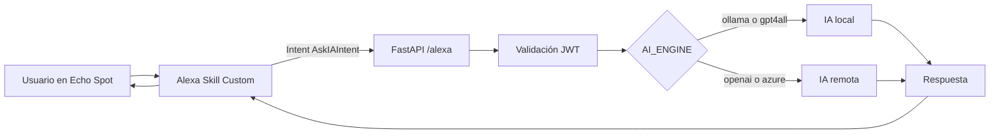

---

# 🧠 Servidor modular FastAPI con Alexa + IA

Servidor modular basado en **FastAPI**, diseñado para integrarse con un **Skill personalizado de Alexa** en dispositivos como **Echo Spot**.
Permite procesar consultas de voz mediante motores de **IA local (Ollama/GPT4All)** o **IA remota (OpenAI/Azure)**, con autenticación JWT, configuración centralizada y endurecimiento básico para desarrollo.

---

## 📦 Estructura del repositorio

```
fastapi-alexa-ia/
│
├── app/
│   ├── auth/
│   │   ├── jwt_handler.py
│   │   └── routes.py
│   ├── modules/
│   │   ├── alexa.py
│   │   ├── ia_engine.py
│   │   ├── ia_local.py
│   │   └── ia_remote.py
│   ├── utils/
│   │   └── logger.py
│   ├── config.py
│   └── main.py
│
├── tests/
│   ├── test_auth.py
│   ├── test_alexa.py
│   ├── test_ia_local.py
│   └── test_ia_remote.py
│
├── requirements.txt
├── Dockerfile
├── .dockerignore
├── .gitignore
├── docker-compose.yml
└── README.md
```

---

## ⚙️ Instalación rápida

```bash
git clone https://github.com/antoniofedele/fastapi-alexa-ia.git
cd fastapi-alexa-ia
python -m venv venv
source venv/bin/activate
pip install -r requirements.txt
```

---

## 🔧 Configuración

Crea un archivo `.env` en la raíz del proyecto:

```env
AI_ENGINE=ollama
OPENAI_API_KEY=tu_api_key
AZURE_OPENAI_ENDPOINT=https://tu-endpoint.openai.azure.com
AZURE_OPENAI_KEY=tu_api_key_azure
OLLAMA_HOST=http://localhost:11434
EXPOSE_CONFIG_ENDPOINT=false
DEMO_USERNAME=admin
DEMO_PASSWORD=1234
JWT_SECRET=clave_secreta_super_segura
```

Notas:
- `JWT_SECRET` debe ser un valor fuerte y único en producción.
- `EXPOSE_CONFIG_ENDPOINT` deja el endpoint de diagnóstico deshabilitado por defecto.
- `DEMO_USERNAME` y `DEMO_PASSWORD` son credenciales de desarrollo; sustitúyelas por validación real en despliegues.

---

## 🚀 Ejecución del servidor

```bash
uvicorn app.main:app --reload
```

Accede a la API en:  
👉 `http://localhost:8000`

---

## 🧪 Pruebas unitarias

```bash
pytest -v
```

Esto ejecutará los tests definidos en `tests/`:
- `test_auth.py` → autenticación JWT  
- `test_alexa.py` → endpoint Alexa  
- `test_ia_local.py` → IA local (mock)  
- `test_ia_remote.py` → IA remota (mock)  

---

## 🐳 Despliegue con Docker

```bash
docker-compose build
docker-compose up -d
```

Servicios disponibles:
- FastAPI → `http://localhost:8000`
- Ollama → `http://localhost:11434`

Ten en cuenta que `.dockerignore` excluye secretos, entornos virtuales y artefactos generados para evitar que entren en la imagen.

## 🔒 Seguridad

- El endpoint de diagnóstico `/config` sólo se publica si `EXPOSE_CONFIG_ENDPOINT=true`.
- El login de desarrollo usa credenciales configurables desde `.env`; no debe usarse como autenticación real.
- El secreto JWT no debe dejarse con el valor por defecto.
- `.gitignore` y `.dockerignore` excluyen `.env`, `app/.env`, `__pycache__`, `.venv` y artefactos de build.

---

## 🎙️ Integración con Alexa Echo Spot

1. Crea un **Skill Custom** en Alexa Developer Console.
2. Define el intent `AskIAIntent` con slot `AMAZON.SearchQuery`.  
3. Configura utterances como:  
   - “pregunta a mi asistente {query}”  
   - “consulta IA {query}”
4. En el campo **Endpoint**, apunta a tu servidor FastAPI (`https://tu-servidor.com/alexa/`).
5. Prueba el Skill en el simulador o directamente en tu Echo Spot.

---

## 🧩 Diagrama del flujo de integración



---

## 💻 Requisitos de hardware

| Tipo de IA | CPU | RAM | GPU | Almacenamiento |
|-------------|-----|-----|-----|----------------|
| **IA Local (Ollama/GPT4All)** | 4 núcleos (8+ recomendado) | 16 GB (32 GB recomendado) | Opcional (CUDA) | 20 GB libres |
| **IA Remota (OpenAI/Azure)** | 2 núcleos | 4 GB | No requerida | 1 GB libres |

---

## 📚 Fuentes oficiales
- Alexa Skills Kit Documentation
- Alexa Custom Skills Guide
- FastAPI Documentation
- Ollama Docs
- OpenAI API Reference

---

## 🧭 Roadmap futuro
- Caché de respuestas IA
- Integración con Prometheus + Grafana
- Pipeline CI/CD con Jenkins
- Skill de Alexa multilenguaje
- Sustituir el login mock por autenticación real con persistencia

---
